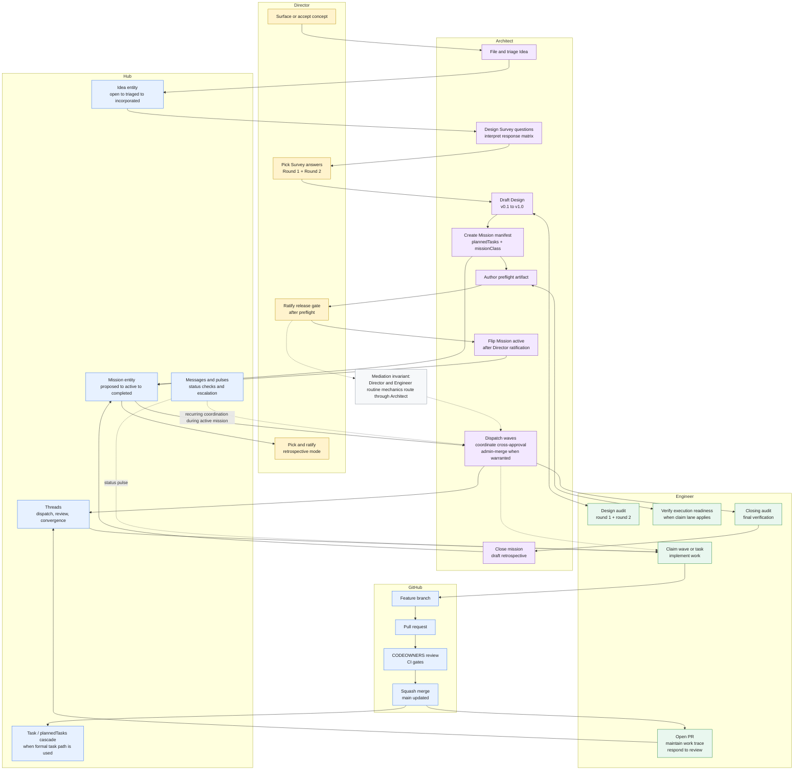
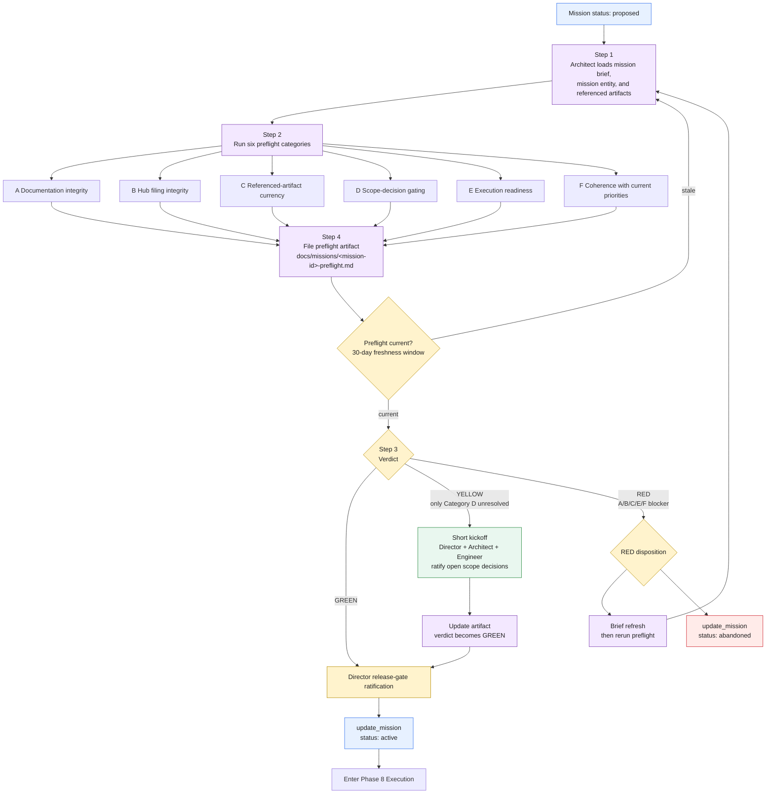
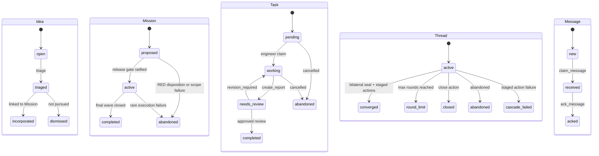

# Mission Lifecycle - Mermaid Diagram Set

**Status:** Draft companion diagram set generated from current methodology docs.
**Primary source:** `docs/methodology/mission-lifecycle.md` v1.2.
**Supporting sources:** `idea-survey.md`, `mission-preflight.md`, `multi-agent-pr-workflow.md`, `entity-mechanics.md`, `trace-management.md`, `strategic-review.md`.

## How to use this document

This document is a visual companion to the methodology. It does not replace the source documents. Use the diagrams as follows:

- **Lifecycle overview:** stakeholder-level view of the 10 macro phases.
- **Role swimlane:** operating model and handoffs across Director, Architect, Engineer, Hub, and GitHub.
- **Preflight and release gate:** detailed activation logic for `proposed -> active`.
- **Execution wave loop:** detailed Phase 8 mechanics across threads, PRs, review, merge, trace, and cascade behavior.
- **Entity state appendix:** implementation-facing FSM reference for the main Hub entities.

The legacy 7-phase lifecycle audit preserved in `mission-lifecycle.md` Appendix A is not the canonical source for these diagrams. These diagrams use the current 10-phase lifecycle.

## 1. Mission Lifecycle Overview

```mermaid
flowchart LR
  Concept["1 Concept<br/>Workflow concept surfaced"] --> Idea["2 Idea<br/>create_idea<br/>open to triaged"]
  Idea --> Survey["3 Survey<br/>Architect 3+3 questions<br/>Director picks intent envelope"]
  Survey --> Design["4 Design<br/>Architect + Engineer<br/>Design v0.1 to v1.0"]
  Idea -.->|bypass allowed for bug-fix or scoped spawned idea| Design
  Design --> Manifest["5 Manifest<br/>create_mission<br/>status: proposed<br/>plannedTasks + missionClass"]
  Manifest --> Preflight["6 Preflight<br/>Architect authors artifact<br/>verdict: GREEN / YELLOW / RED"]
  Preflight --> Gate{"7 Release gate<br/>Director ratifies?"}
  Gate -->|yes| Active["Mission status<br/>proposed to active"]
  Gate -->|redirect| Rework["Refresh brief<br/>or abandon mission"]
  Rework --> Preflight
  Rework -.->|abandon path| Abandoned["Mission status<br/>abandoned"]
  Active --> Execution["8 Execution<br/>W0-Wn wave cascade<br/>PR + cross-approval + merge"]
  Execution --> Close["9 Close<br/>closing wave + audit<br/>active to completed"]
  Close --> RetroMode{"10 Retrospective<br/>mode pick"}
  RetroMode -->|structural / substrate| Walkthrough["Walkthrough<br/>Director-paced review"]
  RetroMode -->|standard mission| Summary["Summary-review<br/>architect doc + Director review"]
  RetroMode -->|spike / cleanup / rare bug-fix| Skip["Skip<br/>closing audit sufficient"]
  Walkthrough --> Done["Mission lifecycle complete"]
  Summary --> Done
  Skip --> Done

  classDef director fill:#fff3cd,stroke:#b58b00,color:#1f1f1f
  classDef hub fill:#e7f1ff,stroke:#2f6fed,color:#1f1f1f
  classDef terminal fill:#e9f7ef,stroke:#22863a,color:#1f1f1f
  class Survey,Gate,RetroMode director
  class Idea,Manifest,Active,Abandoned,Close hub
  class Done terminal
```



## 2. Role Swimlane



## 3. Preflight And Release Gate



## 4. Execution Wave And PR Loop

```mermaid
sequenceDiagram
  autonumber
  participant A as Architect
  participant E as Engineer
  participant H as Hub
  participant G as GitHub
  participant D as Docs

  A->>H: Dispatch wave thread with mission correlationId
  H-->>E: Wave available by thread/message/pulse surface

  loop For each wave W0-Wn
    E->>H: Engage thread and claim work
    E->>D: Update work trace resumption pointer and in-flight state
    E->>G: Create feature branch and push commits
    E->>G: Open PR with mission/task context and test plan
    E->>H: Notify Architect via PR-review thread
    A->>G: Review PR diff and CI status

    alt Changes required
      A->>G: Request changes
      A->>H: Reply on PR-review thread with rationale
      E->>G: Push revisions
      E->>H: Re-notify if scope changed materially
    else Approved
      A->>G: Approve PR
      A->>G: Merge via queue or admin squash merge when warranted
      G-->>A: Main updated
      A->>H: Seal PR-review thread with convergence summary
      E->>D: Update work trace with landed commits and verification
    end

    alt Formal Task entity path
      E->>H: create_report with landed commit and verification
      A->>H: create_review approved or revision_required
      H-->>E: plannedTasks cascade issues next task when approved
    else Thread-dispatch path
      A->>H: Dispatch next wave thread after merge and seal
    end
  end

  A->>H: Final wave complete; set mission status completed
  E->>D: Author closing audit or final verification content
  A->>D: Author retrospective when selected
```

## 5. Entity State Appendix



## Source-to-diagram map

| Diagram | Primary source sections |
|---|---|
| Mission Lifecycle Overview | `mission-lifecycle.md` sections 1, 1.x, 2, 3, 4, 5, 6, 7 |
| Role Swimlane | `mission-lifecycle.md` section 1.5 RACI matrix; `multi-agent-pr-workflow.md` roles and procedure |
| Preflight And Release Gate | `mission-preflight.md` procedure, verdict table, stale-preflight trigger |
| Execution Wave And PR Loop | `mission-lifecycle.md` section 7; `multi-agent-pr-workflow.md` per-PR lifecycle; `trace-management.md` trace discipline |
| Entity State Appendix | `entity-mechanics.md` entity catalog and FSM sections |
