# Mission Lifecycle - Rendered SVG View

**Source Mermaid:** `mission-lifecycle-diagrams.md`
**SVG output directory:** `assets/mission-lifecycle/`

This page embeds the rendered SVGs for local viewing. Regenerate from the source Mermaid with:

```bash
mmdc -i docs/methodology/mission-lifecycle-diagrams.md -o docs/methodology/assets/mission-lifecycle/mission-lifecycle.svg
```

## 1. Mission Lifecycle Overview

[Open SVG](assets/mission-lifecycle/mission-lifecycle-1.svg)



## 2. Role Swimlane

[Open SVG](assets/mission-lifecycle/mission-lifecycle-2.svg)



## 3. Preflight And Release Gate

[Open SVG](assets/mission-lifecycle/mission-lifecycle-3.svg)



## 4. Execution Wave And PR Loop

[Open SVG](assets/mission-lifecycle/mission-lifecycle-4.svg)



## 5. Entity State Appendix

[Open SVG](assets/mission-lifecycle/mission-lifecycle-5.svg)


